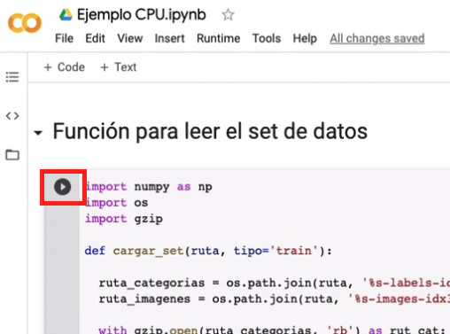

# 📈 Análisis de Ventas y Rendimiento de Múltiples Tiendas

## 🌟 Resumen del Proyecto

Este proyecto es un conjunto de scripts en Python, utilizando la librería **Pandas**, diseñado para realizar un análisis de datos exhaustivo sobre las ventas, la popularidad de los productos, la facturación total y el rendimiento operativo (costos de envío y calificaciones) de múltiples tiendas. El objetivo principal es transformar datos brutos de transacciones en *insights* accionables mediante cálculos de agregación y visualizaciones.

---

## 🏗️ Estructura del Proyecto

El proyecto asume que los datos de las tiendas están cargados y disponibles en una lista de DataFrames de Pandas llamada `tiendas`, donde cada elemento de la lista (`tiendas[0]`, `tiendas[1]`, etc.) representa los datos de una tienda individual (`tienda`, `tienda2`, `tienda3`, `tienda4`).

El análisis se divide en las siguientes secciones clave:

1.  **Facturación Total por Tienda**
2.  **Análisis de Productos Populares**
3.  **Métricas Operacionales** (Calificación y Costo de Envío)
4.  **Generación Interactiva de Gráficos de Venta**

---

## 🚀 Uso del Código

### 1. Como ejecutar el codigo

Para ejeutar el codigo simplemente se tiene que hacer click en el simbolo de "continue" a la izquierda de cada celda de codigo.

### 1. Requisitos e Instalación

Este proyecto solo requiere las librerías estándar de análisis de datos:

* **Python 3.x**
* **Pandas**
* **Matplotlib** (para las visualizaciones)

Para instalar las dependencias necesarias:

```bash
pip install pandas matplotlib
```

### 2. Como ejecutar el codigo

Para ejeutar el codigo simplemente se tiene que hacer click en el simbolo de "continue" a la izquierda de cada celda de codigo.




